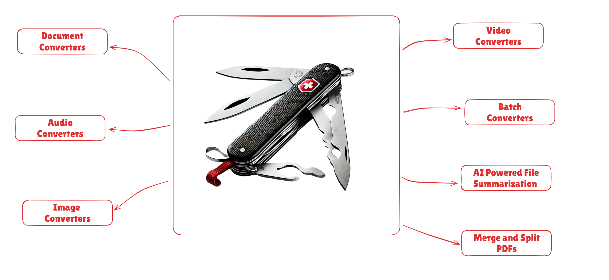

# 🛠️ SwissKnife



A powerful and versatile CLI toolkit for universal file conversion, AI-powered summarization, and file management. Built with Python, this tool serves as your digital Swiss Army knife for handling various file formats and operations.

## 🚀 Features

### 🔄 Universal File Conversion
- **Document Conversion**: Convert between PDF, DOCX, DOC, TXT, MD, EPUB, PPTX, XLSX, HTML, TEX, XML, BIB, JSON, RST, RTF, ODT, ORG, IPYNB, FB2, ICML, OPML, TEXI, TEXTILE, TYP, MUSE, and many more
- **Image Processing**: Transform images between JPG, JPEG, PNG, WEBP, GIF, BMP, TIFF formats, plus convert images to PDF
- **Audio Conversion**: Convert audio files between MP3, WAV, FLAC, AAC, OGG, M4A formats with high-quality encoding
- **Video Processing**: Transform videos between MP4, AVI, MKV, MOV, WMV, FLV, WEBM formats, plus create optimized GIFs
- **Archive Management**: Handle ZIP, TAR, GZ, BZ2, 7Z, RAR archives with extraction and compression capabilities

### 🤖 AI-Powered Features
- **Document Summarization**: Extract and summarize content from text documents using Google's Gemini AI models
- **Intelligent Content Analysis**: Get insights from various file formats
- **Configurable Summary Lengths**: Choose from short, medium, or long summaries
- **Customizable System Prompt**: Modify the AI behavior by editing the `summarize_prompt.txt` file

### 📊 Advanced File Management
- **Batch Processing**: Convert entire directories of files at once
- **Operation Logging**: Track all conversions and operations with detailed logs
- **Smart Format Validation**: Automatic compatibility checking between input and output formats
- **PDF Merge**: Combine multiple PDF files into a single consolidated document
- **PDF Split**: Extract specific pages or page ranges from PDF documents into separate files

**Note**: Some features require external dependencies like LaTeX for PDF conversions and command-line tools for certain archive formats. Please refer to the installation instructions below. Moreover, AI features require a valid Google API key and internet connectivity. Some other conversions like PDF to any other format are not supported due to limitations.

---

## 🔧 Installation

### Basic Installation

Using UV (recommended):
```bash
git clone https://github.com/yourname/swissknife.git
cd swissknife
pip install uv --upgrade
uv sync
```
And active the .venv created.

Or add dependencies manually:
```bash
uv add pypandoc pillow imageio-ffmpeg patoolib google-genai
```

### Gemini Setup (Required for AI Summarization Features)

1. Sign up on AI Studio: [aistudio.google.com](https://aistudio.google.com/)
2. Create a new project and obtain your API key
3. Set the API key as an environment variable:
   ```bash
   export GOOGLE_API_KEY="your_api_key_here"
   ```

### LaTeX Installation (Required for PDF Conversion)

PDF conversion from documents requires LaTeX. Choose the appropriate installation for your system:

#### Windows
1. **MiKTeX (Recommended)**:
   - Download from [miktex.org](https://miktex.org/)
   - Run the installer and follow the setup wizard
   - MiKTeX will automatically install packages on-demand

2. **TeX Live**:
   ```bash
   # Using Chocolatey
   choco install texlive
   ```

#### Linux/Ubuntu
```bash
# Full installation (recommended)
sudo apt update
sudo apt install -y texlive-latex-base texlive-latex-recommended texlive-fonts-recommended texlive-latex-extra

# Minimal installation (faster, smaller)
sudo apt install -y texlive-latex-base texlive-fonts-recommended

# Alternative: TinyTeX (lightweight)
wget -qO- "https://yihui.org/tinytex/install-bin-unix.sh" | sh
export PATH="$HOME/.TinyTeX/bin/x86_64-linux:$PATH"
```

#### MacOS
```bash
# Full installation
brew install --cask basictex
export PATH=/Library/TeX/texbin:$PATH
```

### Archive Unpacking Dependencies

Some archive formats, such as `.7z` and `.rar`, require external command-line tools for extraction. Follow the instructions below to install these tools on your operating system.

---

#### 1. 7-Zip (`.7z` format)

To unpack `.7z` archives, install the `7z` command-line utility:

**Linux (Ubuntu/Debian):**
```bash
sudo apt update
sudo apt install p7zip-full
```

**macOS:**
```bash
brew install p7zip
```

**Windows:**
1. Download and run the installer from the [official 7-Zip website](https://www.7-zip.org/).
2. Add the installation directory (usually `C:\Program Files\7-Zip`) to your system's `PATH` environment variable:
   - Search for "Edit the system environment variables" in the Start Menu.
   - Click "Environment Variables...", find the `Path` variable, and add the directory.

---

#### 2. RAR (`.rar` format)

To pack and unpack `.rar` archives, install the `rar` and `unrar` command-line utility.

**Linux (Ubuntu/Debian):**
```bash
sudo apt update
sudo apt install unrar rar
```

**macOS:**
```bash
brew install unrar rar
```

**Windows:**
1. Download and run the installer from the [official RARLAB website](https://www.rarlab.com/rar_add.htm).

**For Extraction Only (`UnRAR.exe`):**
1. Download the [UnRAR command line version](https://www.rarlab.com/rar_add.htm) for Windows.
2. Extract `UnRAR.exe` to a folder (e.g., `C:\Tools\UnRAR`).
3. Add this folder to your system's `PATH` environment variable.

**For Creation & Extraction (`Rar.exe` and `UnRAR.exe`):**
1. Download the [RAR command line version](https://www.rarlab.com/rar_add.htm) for Windows (e.g., "WinRAR and RAR 64-bit command line version").
2. Extract the contents (including `Rar.exe` and `UnRAR.exe`) to a folder (e.g., `C:\Tools\RAR`).
3. Add this folder to your system's `PATH` environment variable.


## 🚀 Usage

### Help Commands

```bash
# Show general help
python solution.py --help
python solution.py -h

# Get help for specific commands
python solution.py convert --help
python solution.py summarize --help
python solution.py batch-convert --help
python solution.py merge --help
python solution.py split --help
```

### Single File Conversion

The `convert` command handles single file conversions between supported formats:

```bash
# Document conversions
python solution.py convert document.docx output.pdf
python solution.py convert report.md presentation.pptx
python solution.py convert thesis.txt formatted.docx
python solution.py convert data.xlsx summary.pdf
python solution.py convert notes.org academic.tex

# Image conversions
python solution.py convert photo.png compressed.jpg
python solution.py convert diagram.bmp vector.pdf
python solution.py convert screenshot.webp archive.tiff
python solution.py convert animation.gif static.png

# Audio conversions
python solution.py convert song.mp3 lossless.flac
python solution.py convert podcast.wav compressed.aac
python solution.py convert recording.m4a universal.ogg

# Video conversions
python solution.py convert movie.mp4 optimized.webm
python solution.py convert presentation.avi portable.mov
python solution.py convert tutorial.mkv social.gif

# Archive conversions
python solution.py convert backup.zip extracted.tar.gz
python solution.py convert files.rar compressed.7z
```


#### Conversion Options
```bash
# Preserve original file during conversion
python solution.py convert input.docx output.pdf --preserve-original

# Convert password-protected archives
python solution.py convert protected.zip extracted.tar.gz --password mypassword
python solution.py convert secure.rar backup.7z --password archivepassword
```

### Document Summarization

The `summarize` command generates AI-powered summaries of text documents:

```bash
# Generate a summary with default (medium) length
python solution.py summarize document.pdf

# Generate summaries with different lengths
python solution.py summarize report.docx --length short
python solution.py summarize thesis.txt --length medium
python solution.py summarize book.pdf --length long
```

The summary will be displayed in the terminal and saved as `{original_filename}_summary.txt` in the same directory as the input file.

### Custom System Prompt

The AI behavior can be customized by modifying the [`summarize_prompt.txt`](summarize_prompt.txt:1) file. This file contains the system prompt template with the following placeholders:

- `{{FILE_DETAILS}}`: JSON representation of the uploaded file metadata
- `{{SUMMARY_REQUIREMENTS}}`: Description of the desired summary length and format

Example `summarize_prompt.txt` content:
```
You are an AI assistant specialized in generating concise, accurate summaries...
File Details:
{{FILE_DETAILS}}
Summary Requirements:
- {{SUMMARY_REQUIREMENTS}}
```

---

### 📄 PDF Merge

The [`merge`](solution.py:230) command combines multiple PDF files into a single consolidated document:

```bash
# Merge multiple PDF files into one
python solution.py merge file1.pdf file2.pdf file3.pdf

# Merge documents with different names
python solution.py merge report.pdf appendix.pdf references.pdf
```

The merged PDF will be saved as `merged_{input_names}.pdf` in the current directory, where `{input_names}` is a concatenation of the input file stems separated by underscores.

### ✂️ PDF Split

The [`split`](solution.py:240) command extracts specific pages or page ranges from a PDF document into separate files:

```bash
# Extract pages 1-3, page 5, and pages 7-9 into separate files
python solution.py split document.pdf "1-3,5,7-9"

# Extract only the first 5 pages
python solution.py split book.pdf "1-5"

# Extract specific individual pages
python solution.py split manual.pdf "1,3,5,10"
```

The split command creates separate PDF files named `{original_filename}_part{number}.pdf` for each specified page range. Page numbers are 1-based and inclusive.

#### Split Page Range Syntax
- **Single page**: `5` (extracts page 5)
- **Page range**: `1-3` (extracts pages 1, 2, and 3)
- **Multiple ranges**: `1-3,5,7-9` (extracts pages 1-3, page 5, and pages 7-9)
- **Mixed**: Combine individual pages and ranges as needed

---

## 📦 Dependencies

### Core Dependencies
- **Python 3.8+**: Base runtime environment
- **argparse**: Command-line interface parsing (stdlib)
- **pathlib**: Modern path handling (stdlib)
- **tempfile**: Temporary file management (stdlib)
- **subprocess**: External process execution (stdlib)

### Document Processing
- **pypandoc**: Universal document converter (requires Pandoc)
- **python-docx**: Microsoft Word document handling
- **pdfplumber**: PDF text extraction and analysis
- **openpyxl**: Excel file processing

### Media Processing
- **Pillow (PIL)**: Image processing and conversion
- **imageio-ffmpeg**: Video and audio conversion backend
- **pydub**: Audio manipulation and format conversion
- **moviepy**: Video editing and processing

### Archive Handling
- **patoolib**: Universal archive extraction and creation

### AI and Machine Learning
- **google-genai**: Google Gemini AI integration for text summarization and analysis

---

## 📁 Project Structure

```
swissknife/
├── solution.py             # Main CLI application entry point
├── pyproject.toml          # Project dependencies and configuration
├── uv.lock                 # Locked dependency versions
├── README.md               # Original project documentation
├── NEW_README.md           # This comprehensive documentation
├── .gitignore              # Git ignore patterns
├── .python-version         # Python version specification
├── .mypy_cache/            # Type checking cache
├── samples/                # Sample input files for testing
│   ├── README.docx         # Sample Word document
│   ├── tenor_1.gif         # Sample animated GIF
│   ├── Kanye_West_Ft_Pusha_T_-_Runaway_Offblogmedia.com.mp3  # Sample audio
│   └── 20584448-uhd_3840_2160_60fps.mp4  # Sample video
└── outputs/                # Default output directory (created on first use)
```

---
